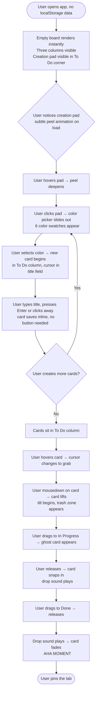
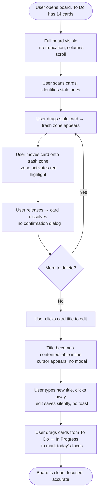
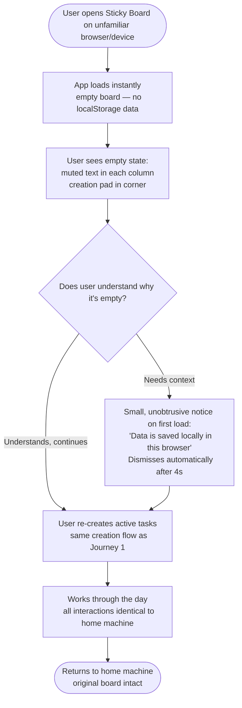

# UX Design Specification — Sticky Board

**Author:** Keith
**Date:** 2026-03-11

---

## Executive Summary

### Project Vision

Sticky Board is a zero-friction, browser-based personal Kanban board with the tactile warmth of a physical sticky-note system. No accounts, no backend, no setup — open a browser tab and the board is there. Three fixed columns (To Do / In Progress / Done), post-it cards in choosable colors, drag-and-drop movement, and a hand-drawn sketchy aesthetic that makes digital task management feel physical and immediate.

The product's power comes from deliberate constraint. What's *not* in Sticky Board is as important as what is. Each omission is intentional — the UX must protect and celebrate that constraint at every turn.

### Target Users

**Alex — The Pragmatic Solo Doer** (developer / freelancer / knowledge worker, 28–40)

Alex manages their own daily workload independently. They're comfortable with technology but frustrated by tools that require setup, accounts, or onboarding before they can write down three things they need to do today. They appreciate well-crafted design — the kind of app that feels like it was made with care. They have a pack of physical sticky notes somewhere on their desk that rarely get used because they get lost.

Alex's primary context: desktop, pinned browser tab, keyboard and mouse. Board is the first thing they open in the morning.

### Key Design Challenges

1. **Invisible onboarding**: With zero instruction, the UI must teach itself through affordances alone — peel animations, hover states, visual hierarchy. Every interaction must be discoverable without tutorial overlays or tooltips.
2. **Constraint as design principle**: The UX must resist escape hatches. No settings link, no "advanced options," no feature hints. The design must communicate "this is all you need" rather than "there's more hidden somewhere."
3. **Drag-and-drop choreography**: The trash zone appearing on drag start, card tilt animations, column drop targets, within-column reordering — these interactions must feel smooth and physical, not like web app widgets.
4. **Empty state as invitation**: An empty board is always the first experience for a new user. It must feel like an invitation to begin, not an error or an incomplete product.

### Design Opportunities

1. **Microinteraction as brand identity**: The soft drop sound, the card tilt, the peel animation — these are not decorations. They *are* the product's personality and the primary differentiator from generic task apps.
2. **Color as the first gesture**: Making color selection the very first act of card creation (not an afterthought) builds an emotional bond between user and card from the start.
3. **The Done column as a celebration surface**: Faded cards accumulating in Done is a visible record of accomplishment — worth designing with intention, not just as a CSS afterthought.

---

## Core User Experience

### Defining Experience

The heart of Sticky Board is **the drag**. Not the creation, not the deletion — the moment a user picks up a card and moves it. That physical gesture — grabbing a task and physically relocating its status — is the product's core promise made tangible. The entire UX is designed to make that gesture feel as close to touching a real post-it note as a web browser can deliver.

Card creation is the on-ramp: fast, colorful, opinionated. But the drag is the ritual. It's what users do ten times a day, what they think about when they think about the app, and the interaction that earns the product its place in their pinned tabs.

### Platform Strategy

- **Primary platform:** Desktop web, pinned browser tab, mouse and keyboard
- **Input model:** Mouse-driven drag-and-drop is the primary interaction; keyboard accessibility required but secondary in the interaction hierarchy
- **Responsive:** Layout adapts for smaller viewports; touch support on mobile is a bonus, not a requirement for MVP
- **Offline-capable by design:** localStorage-only persistence means the app works offline inherently — no network dependency
- **Deployment:** Fully static, no backend — simplicity is a feature, not a compromise

### Effortless Interactions

These interactions must require zero conscious thought:

1. **Board persistence**: The board is simply always there on return. No loading indicator, no "fetching your data." It appears instantly from localStorage as if it was never gone.
2. **Card creation flow**: Click pad → pick color → start typing. Three steps, no modal, no form, no save button. The card exists the moment you begin.
3. **Column drop targeting**: While dragging, valid drop zones should be unmistakably obvious. No guesswork about where a card will land.
4. **Inline editing**: Click a card title or description → it becomes editable immediately. No mode switch, no pencil icon, no save confirmation.

### Critical Success Moments

| Moment | Why It Matters |
|---|---|
| The first card appears | Proves zero-friction: user achieved something real in under 30 seconds with no instruction |
| First drag to Done + drop sound | The "aha moment" — this is the moment the product earns loyalty |
| Board reloads perfectly after refresh | Builds trust: the app respects your work, nothing is lost |
| Empty state on first visit | Determines whether a new user explores or abandons |
| Trash zone appears during drag | Discoverable deletion — no hidden menus needed |

### Experience Principles

1. **The gesture is the product**: Every design decision serves the drag. Animations, sounds, visual states — all exist to make movement feel physical and satisfying.
2. **Trust is earned silently**: Persistence, reliability, and data integrity are never announced — they're just always true. The best feature is the one the user never has to think about.
3. **Constraint is clarity**: The absence of options is itself a UX decision. A user who never sees a settings panel never wonders if they're using it wrong.
4. **The board teaches itself**: Every affordance must be discoverable through natural curiosity — hover states, subtle animations, and visual weight guide the user without instruction.
5. **Completion deserves recognition**: Moving a card to Done should feel like crossing something off a list. The fading, the column position, the sound — these conspire to make accomplishment feel real.

---

## Desired Emotional Response

### Primary Emotional Goals

The word that should define Sticky Board is **satisfaction** — the quiet, solid satisfaction of a physical object doing exactly what it was made to do. Not excitement, not delight (though delight is welcome) — *satisfaction*. The same feeling as closing a notebook, capping a pen, crossing something off a paper list.

Secondary feelings that reinforce the primary:

- **Calm**: The board is uncluttered. It doesn't demand attention. It waits. Opening Sticky Board in the morning should feel like arriving at a clean desk.
- **In control**: Three columns. Everything visible. No hidden backlog pages, no collapsed sections. The entire system fits on one screen. That visibility is itself a feeling of mastery.
- **Trusted**: The board never loses work, never asks for Wi-Fi, never requires a login. That reliability builds a relationship over time — the feeling that this tool is *on your side*.

### Emotional Journey Mapping

| Stage | Desired Feeling | Design Driver |
|---|---|---|
| First visit (empty board) | Curious, invited | Empty state communicates possibility, not emptiness |
| Creating the first card | Engaged, playful | Color picker as first gesture; card appears instantly |
| During a drag | Focused, physical | Card tilt, smooth movement, visible drop target |
| Dropping to Done + sound | Satisfied, accomplished | Sound + fade = completing a physical act |
| Returning to a full board | Oriented, ready | Board restores instantly; familiar, like walking back to a desk |
| Completing everything in Done | Quietly proud | Full Done column as a visible record of effort |
| Data doesn't persist (private browsing) | Informed, not betrayed | Clear, honest notice without drama or blame |

### Micro-Emotions

**Cultivate:**
- **Confidence** through predictable, consistent interaction responses
- **Delight** through the drop sound and tilt animation — small surprises that never get old
- **Trust** through silent, reliable persistence
- **Accomplishment** through the Done column's growing visual weight

**Vigilantly avoid:**
- **Anxiety** — the board must never feel like it might lose data, glitch, or forget state
- **Guilt** — an overflowing To Do column should never feel punishing; it's neutral, just a list
- **Confusion** — every interaction must have exactly one obvious outcome
- **Overwhelm** — the fixed three-column structure is the antidote to the infinite scroll of most task apps

### Design Implications

| Emotional Goal | UX Design Approach |
|---|---|
| Satisfaction | Drop sound + card fade on Done; definitive visual state changes, not subtle |
| Calm | Warm, low-contrast colors; hand-drawn aesthetic softens sharp UI edges |
| In control | Always-visible full board; no pagination, no collapse, no hidden state |
| Trusted | No loading states; instant localStorage restore with zero flicker |
| Delight without noise | Microinteractions are present but not forced — they reward natural use |

### Emotional Design Principles

1. **Earn trust through reliability, not promises**: Never make claims about persistence — just persist, perfectly, every time.
2. **Delight must be proportional**: Animations and sounds are rewards for completing work, not notifications for routine actions.
3. **The aesthetic carries the emotion**: The hand-drawn look isn't visual styling — it's the primary vehicle for the "tactile, physical" feeling the product promises.
4. **Negative space has emotional weight**: The empty board at first launch, the gap where a deleted card was — these moments communicate intentional calm, not absence.

---

## UX Pattern Analysis & Inspiration

### Inspiring Products Analysis

**Things 3 (Cultured Code)**
- *What it does brilliantly*: Makes task completion feel like a physical act. The "complete" animation — the checkbox fills, the item fades and moves — is deeply satisfying. Task management woven around natural daily rhythm.
- *Transferable*: The "completion as a physical gesture" philosophy. Visual differentiation between active and completed items. The restraint in not overloading the interface.

**Apple Notes (iOS/macOS)**
- *What it does brilliantly*: Invisible persistence. Notes just live there. No save button, no confirmation, no sync spinner. The UI gets out of the way entirely.
- *Transferable*: Auto-save invisibility. Inline editing that feels native. The handwritten texture of the yellow notepad view.

**Bear Writer**
- *What it does brilliantly*: Typography and focus. The writing area feels like a physical page. Simple, warm aesthetic with a strong visual identity.
- *Transferable*: Warm background tones. Handwritten-adjacent font choices. The sense that the tool was designed with craft and care.

**Physical sticky notes / corkboard (the real thing)**
- *The ultimate inspiration*: Color carries meaning before you even read text. Spatial arrangement IS the status system. Moving a note is a physical, satisfying act. The constraint (you can only fit so many on the board) creates natural WIP limits.
- *Transferable*: Everything. The product is fundamentally a digital translation of this physical system.

### Transferable Patterns

**Interaction Patterns to Adopt:**
- **Drag-as-status-change**: The physical gesture *is* the action. No button labels needed.
- **Color-first creation**: Choose color before typing, like picking which notepad to write on.
- **Inline, direct manipulation editing**: Click the text, edit the text. No modes, no modals.
- **Completion fade**: Done items visually recede without disappearing — they're still there, just quieter.

**Visual Patterns to Adopt:**
- **Warm, off-white paper texture** as the base surface — not stark white, not dark
- **Slight drop shadows on cards** — physical depth without skeuomorphic excess
- **Hand-drawn borders** for columns — rough.js gives structure without rigidity

### Anti-Patterns to Avoid

| Anti-Pattern | Why to Avoid |
|---|---|
| Onboarding modals / tooltips | Breaks the "just use it" promise; the UI must teach itself |
| Settings panels | Creates decision fatigue; every option undermines the constraint philosophy |
| Confirmation dialogs for deletion | Destroys drag-to-trash flow; trust the user, let them undo |
| Loading spinners or skeleton screens | localStorage is synchronous; there's no loading state, ever |
| Status bar with counts or metrics | Turns a personal ritual into a productivity dashboard — wrong tone |
| Toast notifications for routine actions | Clutters the calm; reserve notification space for genuine errors |

### Design Inspiration Strategy

**Adopt directly**: Things 3's completion gesture philosophy; Apple Notes' invisible persistence model; the physical post-it's color-as-identifier and spatial-as-status systems.

**Adapt**: Bear's warm typography approach translated to shorter card text rather than long-form writing. Things 3's completion animation adapted for a card (fade + column move rather than checkbox check).

**Avoid entirely**: Productivity app metrics dashboards; onboarding flows; modal-heavy CRUD patterns; any UI chrome that competes with the cards for attention.

---

## Design System Choice

### Decision: Custom Design System

**Sticky Board requires a fully custom design system.** No third-party component library (MUI, Chakra, Ant Design, Tailwind UI) is appropriate for this product.

**Rationale:**

The product's visual identity *is* the design. The hand-drawn aesthetic, warm paper tones, post-it card look, and sketchy column borders are not skin-deep styling — they are the core user experience differentiator. Any third-party component library would impose its own widget chrome (button styles, input borders, modal backdrops, focus rings) that would undermine and conflict with the hand-crafted feel.

**Approved Dependencies:**
- **rough.js** — for hand-drawn SVG rendering of board background and column borders
- **Google Fonts** — Caveat or Patrick Hand for handwritten typography
- **dnd-kit** — for drag-and-drop mechanics (a focused, headless library with no visual opinions)
- **CSS custom properties** — for design token implementation (colors, spacing, typography scale)

**What this means in practice:**
Every visible component is built from scratch: cards, columns, the creation pad, the trash zone, the color picker. No `<Button variant="primary">`, no `<Modal>`. Pure HTML + CSS + React, styled to look like they belong on a corkboard.

### Design Tokens

All visual values expressed as CSS custom properties for consistency:

```
--color-board-bg: #F5EFE0        (warm cream/parchment)
--color-column-border: #8B7355    (warm brown, hand-drawn via rough.js)
--color-card-yellow: #FFE135
--color-card-pink: #FF9999
--color-card-blue: #A8D8EA
--color-card-green: #B8E0B0
--color-card-orange: #FFB347
--color-card-purple: #D4A5E5
--color-card-shadow: rgba(0,0,0,0.15)
--color-text-primary: #2C2416     (dark warm brown, not harsh black)
--color-done-overlay: rgba(255,255,255,0.5)  (for Done card fade)
--font-handwritten: 'Caveat', cursive
--font-size-card-title: 1.1rem
--font-size-card-desc: 0.875rem
--spacing-base: 8px
--border-radius-card: 2px         (cards are nearly square, minimal rounding)
```

---

## Defining Core Experience

### The Defining Experience: The Drag

Sticky Board's defining experience — the ONE interaction we must get perfectly right — is **dragging a card from one column to another**.

If this feels physical, responsive, and satisfying, everything else is forgivable. If this feels laggy, imprecise, or mechanical, nothing else can compensate.

**Why this is the defining experience:**
- It is the most frequent action a returning user performs
- It is the moment the "tactile post-it" metaphor either works or falls apart
- It is the action that produces the "aha moment" (drag to Done + sound)
- It is the differentiator from a simple list app

### User Mental Model

Users arrive with the mental model of **moving a physical sticky note from one section of a wall to another**. This is the exact mental model we design to. Implications:

- The card should feel like it has **weight** — a tilt when lifted, a definitive drop
- The card should follow the cursor **exactly**, not lag or rubber-band
- Valid drop targets should be **spatially obvious** — you can see where the card will land
- The action should feel **irreversible in a good way** — like a physical placement

### Core Experience Mechanics

**1. Initiation — Picking Up a Card**
- Trigger: Mouse down on any part of the card face
- Response: Card lifts (slight scale-up + drop shadow increase), immediately begins tilting 5–8° in the direction of movement
- Simultaneous: Trash zone fades in at a consistent screen location (bottom-center or lower-right corner)
- Simultaneous: All columns show a subtle "drop here" visual indicator

**2. Interaction — In-Flight State**
- Card follows cursor precisely with no lag (60fps animation target)
- Card maintains its tilt angle relative to movement direction
- As cursor enters a valid column drop zone: column highlights with a subtle background shift and a ghost card appears at the insertion point showing where the card will land
- As cursor enters the trash zone: trash zone activates (color change, subtle scale)

**3. Feedback — Landing**
- On release over a valid column: card snaps smoothly to the insertion position; tilt releases back to 0°; drop sound plays; trash zone fades out
- On release over the trash zone: card dissolves/shrinks away; trash zone returns to normal; no drop sound (different audio signature, or silence)
- On release over an invalid zone: card snaps back to original position with a gentle ease

**4. Completion — Done State**
- When a card lands in the Done column: after the drop animation settles (approx 300ms), the card transitions to its faded/muted state — a CSS transition on opacity + slight desaturation
- The drop sound plays on release, before the fade — the sound is the reward, the fade is the confirmation

### Success Criteria for the Drag

| Criterion | Target |
|---|---|
| Drag response time | < 16ms from mousedown to card lift (imperceptible) |
| Frame rate during drag | 60fps sustained |
| Drop zone recognition accuracy | 100% — card always lands where the ghost indicated |
| Drop sound latency | < 50ms from release to audio playback |
| Tilt angle | 5–8° (feels physical without being dramatic) |

---

## Visual Design Foundation

### Color System

**Board Surface:**
The board background is warm parchment — `#F5EFE0` — not stark white. This is the most critical single color decision in the product. It establishes the "physical material" feeling that carries through everything else. Column areas have a marginally different shade (`#EDE8D8`) to define spatial zones without hard borders.

**Card Palette (6 colors):**
The card color palette is deliberately warm-shifted and slightly desaturated — these are post-it note colors, not tech-UI primary colors:

| Color Name | Hex | Feel |
|---|---|---|
| Yellow (default) | `#FFE135` | Classic sticky note; warm, primary |
| Pink | `#FF9E9E` | Soft, approachable |
| Blue | `#A8D8EA` | Cool focus, calm |
| Green | `#B8E0B0` | Nature, growth, progress |
| Orange | `#FFB880` | Energy, urgency |
| Purple | `#D4AAEA` | Creative, different |

**Done State:**
Cards in the Done column receive `opacity: 0.55` and a `filter: saturate(0.7)`. They are visually receded but still legible. The fading is a *reward*, not an erasure.

**Text:**
Primary text on cards is `#2C2416` — a warm dark brown, not pure black. Against the lightest card backgrounds (yellow) this achieves comfortable reading contrast at WCAG AA.

**Destructive / Trash Zone:**
The trash zone uses `#E8584A` (warm red) in its active state, transitioning from a neutral grey-brown at rest.

### Typography System

**Primary Font: Caveat** (Google Fonts)
- Used for all card titles, column headers, and UI labels
- Weights: 400 (body), 700 (card titles, column headers)
- Character: Casual handwriting without illegibility — reads clearly at small sizes
- Fallback chain: `'Caveat', 'Patrick Hand', cursive`

**Type Scale:**
| Role | Size | Weight | Color |
|---|---|---|---|
| Column header | 1.25rem | 700 | `#5C4A2A` (warm brown) |
| Card title | 1.05rem | 700 | `#2C2416` |
| Card description | 0.875rem | 400 | `#4A3A28` |
| Empty state text | 0.9rem | 400 | `#9A8C78` (muted) |
| Error/notice text | 0.85rem | 400 | System default |

**Line height:** 1.4 for card content (slightly generous — handwritten fonts need breathing room).

### Spacing & Layout Foundation

**Base unit: 8px**

All spacing is multiples of 8px: padding within cards (16px), gap between cards (12px), column padding (20px), gap between columns (24px).

**Board Layout:**
- Max board width: 1400px, centered in viewport
- Three equal-width columns in a CSS Grid (`repeat(3, 1fr)`)
- Column minimum height: 100vh — columns always fill the screen height
- Columns scroll independently (vertical overflow scroll) when card count exceeds viewport height

**Card Dimensions:**
- Width: 100% of column width minus column padding
- Min-height: 80px (enough for a title + one line description)
- Cards are taller than they are wide — portrait orientation, like real post-its

### Accessibility Considerations

- All card background colors tested against `#2C2416` text at WCAG 2.1 AA (4.5:1 minimum) — yellow at `#FFE135` is the tightest; text color darkens to `#1A1008` on yellow if needed
- Done state fading (`opacity: 0.55`) may reduce contrast — Done column text receives a contrast boost to compensate: `font-weight: 700` on Done card titles
- Keyboard focus indicators: high-contrast outline (`2px solid #4A90D9`) that doesn't clash with the warm palette

---

## Design Direction Decision

### Design Direction: Warm Cork Board — Single, Definitive

There is only one appropriate visual direction for Sticky Board. The PRD defines the aesthetic so precisely — hand-drawn, warm paper, post-it cards, cork board — that exploring radically different directions would be design theater. The direction chose itself.

**"Warm Cork Board" — Detailed Direction:**

- **Background**: Warm parchment (#F5EFE0), subtle paper grain texture (CSS noise or SVG pattern at low opacity)
- **Columns**: Defined by rough.js SVG rectangles — hand-drawn borders in warm brown, not CSS `border`. The slight irregularity of rough.js lines is essential to the aesthetic.
- **Column Headers**: Large (1.25rem), Caveat Bold, warm brown — positioned like labels stuck above the section of a corkboard
- **Cards**: Slightly rotated 0–2° at random on creation (subtle, not chaotic) to simulate physical placement. White or near-white inner shadow suggests curling edges. Genuine drop shadow `(0 2px 4px rgba(0,0,0,0.15))`.
- **Board chrome**: Minimal. No header bar, no navigation, no settings gear. The board IS the entire viewport. Any chrome competes with the cards.
- **Creation pad**: In the top-left corner of the To Do column — a small stack of blank post-it notes rendered with rough.js, with a gentle dog-ear peel effect on hover.

### Design Rationale

This direction works because:
1. It eliminates the gap between the product's promise ("digital sticky notes") and its visual appearance
2. It makes the constraint feel intentional — three columns on a cork board isn't a limitation, it's the whole point
3. The aesthetic creates immediate familiarity for the mental model users already carry
4. rough.js borders signal "handmade" at a subconscious level — this is a crafted object, not a generated UI

### Implementation Approach

- rough.js renders board background lines and column borders as SVG, positioned absolutely behind the card content
- Cards are React components with CSS custom properties for their individual color
- The board background texture is a lightweight repeating SVG pattern (< 2KB)
- Random card rotation is applied as a CSS transform on mount, stored with card state to persist across sessions

---

## User Journey Flows

### Journey 1: First-Time Use (Empty Board → First Done Card)



**Key UX notes for Journey 1:**
- Empty state in To Do shows a subtle hand-drawn dashed border with text "Your tasks go here" in muted Caveat — not a modal, not a tooltip, just ambient text that disappears once the first card exists
- Color picker appears directly adjacent to the pad, not as a floating modal — it's spatially attached to the creation gesture
- No "save" concept exists — the card is real the moment the user begins typing

---

### Journey 2: Board Cleanup (Inline Edit + Drag-to-Trash)



**Key UX notes for Journey 2:**
- Trash zone appears **only** during an active drag — it is invisible otherwise, discovered through use
- No undo — deletion is permanent and intentional. The physical metaphor (tearing up a post-it) supports this.
- Inline edit is activated by a single click on text — no double-click requirement, no icon to click first
- Columns overflow scrolls vertically so all 14 cards in To Do are accessible without the column expanding to push others off-screen

---

### Journey 3: New Browser Context (Empty State Recovery)



**Key UX notes for Journey 3:**
- The "data is saved locally" notice is shown once per browser session on an empty board. It is not a warning — it is informational, in the same calm Caveat font as the rest of the product.
- The empty state is deliberately designed not to feel broken — three well-defined columns with ambient guidance text communicates "this is ready" not "something is missing."

---

### Journey Patterns Summary

| Pattern | Implementation |
|---|---|
| Card creation entry point | Creation pad in To Do column with peel affordance |
| Column as drop target | Full column body is a valid drop zone, not just the stack |
| Inline editing activation | Single click on card text |
| Deletion gesture | Drag-to-trash (appears during drag only) |
| Persistence feedback | None visible — silence is the signal |
| Empty state guidance | Ambient text fades once board has content |

---

## Component Strategy

### Approach: All Custom, Zero Third-Party Components

Every visible UI component is built from scratch. No component library. The design system tokens defined above govern all styling decisions.

### Component Inventory

#### `<Board />`
**Purpose:** Root container. Renders the corkboard background (rough.js SVG layer) and hosts the three column layout.
**States:** `has-cards` / `empty` (controls ambient empty-state guidance visibility)
**Notes:** The rough.js SVG is an absolutely-positioned background layer. The CSS Grid of columns sits above it. The board never scrolls horizontally — it is always full-viewport-width.

---

#### `<Column />`
**Purpose:** Holds a list of cards for one status (To Do / In Progress / Done).
**Props:** `id`, `title`, `cards[]`, `isDragOver`
**States:**
- Default — normal
- `drag-over` — subtle background highlight when a card is being dragged over it
**Notes:** Columns scroll vertically independently. The column header is always visible (sticky top within the column). For the Done column, applies the fade/desaturation CSS class to all child cards.

---

#### `<Card />`
**Purpose:** Represents a single task as a post-it note card.
**Props:** `id`, `title`, `description`, `color`, `columnId`, `rotation`
**States:**
- Default — at rest
- `is-editing-title` — title field is contenteditable
- `is-editing-desc` — description field is contenteditable
- `is-dragging` — lifted, tilted, follows cursor
- `is-done` — faded/desaturated (applied when in Done column)
**Anatomy:** Card background (colored per `color` prop) → Card title (Caveat Bold) → Card description (Caveat Regular, optional, hidden until present) → subtle edge shadow
**Notes:** `rotation` is a random value between -2° and +2°, generated on card creation and persisted to localStorage. Cards in Done column override rotation to 0° (settled feeling).

---

#### `<CardCreationPad />`
**Purpose:** The sticky-note pad from which new cards are created. Lives in the To Do column header area.
**States:**
- Default — small stack of blank post-its with dog-ear
- `hovered` — peel animation deepens
- `active` — color picker open, new card creation in progress
**Notes:** Clicking the pad immediately opens the color picker inline. The color picker is not a floating modal — it appears as an expansion of the pad area, anchored to the column.

---

#### `<ColorPicker />`
**Purpose:** Inline color selection during card creation.
**Props:** `onColorSelect`, `defaultColor` (yellow)
**States:** `open` / `closed`
**Anatomy:** 6 colored circular swatches, equal size, single row. Selected state shown by ring/scale.
**Notes:** Keyboard-navigable (arrow keys between swatches, Enter to select). Color picker auto-closes after selection. Yellow is the default/pre-selected color.

---

#### `<TrashZone />`
**Purpose:** Deletion target that appears during any card drag.
**States:**
- Hidden (no drag in progress)
- `resting` — visible, neutral grey-brown, trash icon, label "Drop to delete"
- `active` — drag is hovering over zone; activates red, scale-up
**Notes:** Positioned fixed at bottom-center of viewport. Appears with a fade-in animation when drag begins. Card dropped here is removed from state immediately, no confirmation.

---

#### `<DragGhost />`
**Purpose:** Visual ghost card shown at the prospective drop position in a column during drag, indicating where the card will land.
**Notes:** Headless dnd-kit provides the drag layer; the ghost is a lightly-styled card outline (dashed border, card color at 30% opacity) that appears in the target column as the dragged card hovers over it.

---

#### `<EmptyColumnState />`
**Purpose:** Ambient placeholder shown inside an empty column.
**Notes:** Muted Caveat text, slightly larger than body text. For To Do: *"Your tasks go here"*. For In Progress: *"Drag cards here to start"*. For Done: *"Completed tasks land here"*. These texts are replaced by actual cards the moment the first card exists in that column.

---

#### `<StorageNotice />`
**Purpose:** Informational banner shown once on empty board in a new browser context.
**States:** `visible` / `dismissed`
**Notes:** Auto-dismisses after 4 seconds. Non-blocking (not a modal). Styled in the same warm palette, not a system alert color. One-time per browser session.

---

#### `<StorageErrorNotice />`
**Purpose:** Non-blocking error message shown when localStorage write fails (quota exceeded or unavailable).
**Notes:** Persistent until dismissed (user must acknowledge). Does not block board use. Clearly explains what happened without technical jargon: *"Your board can't be saved right now — local storage may be full."*

---

### Component Implementation Priority

| Priority | Component | Required For |
|---|---|---|
| 1 | `<Board />` | All journeys |
| 1 | `<Column />` | All journeys |
| 1 | `<Card />` | All journeys |
| 1 | `<CardCreationPad />` | Card creation |
| 1 | `<ColorPicker />` | Card creation |
| 1 | `<TrashZone />` | Card deletion |
| 2 | `<DragGhost />` | Drag affordance |
| 2 | `<EmptyColumnState />` | Empty state / first-time UX |
| 3 | `<StorageNotice />` | New browser context journey |
| 3 | `<StorageErrorNotice />` | Error handling |

---

## UX Consistency Patterns

### Inline Editing Pattern

**Rule:** All text editing happens inline, directly on the card, via `contenteditable`. No modals, no separate edit views, no edit buttons.

**Trigger:** Single click on any card text (title or description)
**Entry:** The text becomes immediately editable — cursor appears, text is selectable
**Exit:** Click outside the card, press `Escape`, or press `Enter` (for title only — description allows multi-line)
**Save:** Automatic on exit — no save button, no confirmation
**Validation:** Card title cannot be blank. On exit with blank title, restore the previous title silently (no error toast).
**Visual treatment:** Editing state is indicated by a subtle background shift on the text area and a thin inset focus ring — not a box appearing from nowhere.

---

### Drag Interaction Pattern

**Rule:** Dragging is the primary status-change gesture. Every card is always draggable. Drag-to-column changes status. Drag-to-trash deletes.

**Lift:** Mousedown on card face begins drag immediately (no drag threshold delay — cards should feel lightweight)
**In-flight visual treatment:**
- Card: scale 1.03, shadow increases, tilts 5–8°
- All columns: subtle "ready to receive" highlight
- Target column on hover: more pronounced highlight + ghost card at drop position
- Trash zone: fades in bottom-center

**Drop:** Card releases, snaps into position. Drop sound plays (single audio sample, played via Web Audio API pre-loaded at app init to avoid latency). Tilt releases to 0°.

**Cancellation:** Pressing `Escape` during drag cancels and returns card to origin with ease animation.

---

### Empty State Pattern

**Rule:** Every state of "nothing here yet" is an invitation, not an error.

Three levels of empty state:

1. **Empty column**: Ambient muted text (column-specific) — no icons, no illustration, no CTA button
2. **Empty board (first visit)**: Ambient text in all three columns. The creation pad is the only CTA — no overlay, no "Get Started" button.
3. **Empty board (returning user, new browser)**: Same as first visit + one-time `<StorageNotice />`.

Empty states never use the word "empty," "no data," or "nothing here." They use forward-looking language that describes what the space is *for*.

---

### Feedback Pattern

**Rule:** Feedback is proportional. Routine success is silent. Errors are clear but calm.

| Situation | Feedback Type | Visual Treatment |
|---|---|---|
| Card created | Silent | Card appears instantly |
| Card moved to column | Audio (drop sound) | Sound only — no toast |
| Card moved to Done | Audio + visual (fade) | Sound + fade transition |
| Card deleted | Silent | Card removes from DOM |
| Inline edit saved | Silent | Text updates in place |
| localStorage unavailable | `<StorageNotice />` | Auto-dismiss banner |
| localStorage quota exceeded | `<StorageErrorNotice />` | Persistent banner until dismissed |
| Drag cancelled (Escape) | Visual (card returns) | Ease animation back to origin |

**No toast notifications for any routine action.** The board is the feedback. Changes are immediately visible on the board itself.

---

### Error Recovery Pattern

**Rule:** Errors default to graceful degradation, never broken state.

| Error | Recovery Behavior |
|---|---|
| Corrupt localStorage entry on load | App defaults to empty board; no crash; no error message on first load (silent recovery) |
| localStorage unavailable (private browsing) | App works normally; `<StorageNotice />` explains data won't persist |
| localStorage quota exceeded on write | Board rendered from in-memory state continues to work; `<StorageErrorNotice />` shown |
| Network failure | No impact — app has no network dependency |

---

## Responsive Design & Accessibility

### Responsive Strategy

**Primary context: Desktop (≥1024px)**
The full three-column board layout is intended for and optimized for desktop viewports. This is enforced by the product's core use case: a pinned browser tab used at a desk.

**Tablet (768px – 1023px)**
The three-column layout compresses. Columns narrow but remain side by side. Card text may truncate with ellipsis on titles longer than ~40 characters. Font size does not reduce below 0.875rem. The board remains functional; touch drag is supported by dnd-kit's pointer events.

**Mobile (< 768px)**
The three-column layout collapses to a vertical single-column scroll with a tab/pill switcher for To Do / In Progress / Done. Drag within a column remains supported; cross-column moves happen via a long-press context menu ("Move to..." with column options). This is the only concession to mobile that adds UI complexity — the underlying data model is identical.

**Breakpoints:**
```
Mobile:  < 768px
Tablet:  768px – 1023px  
Desktop: ≥ 1024px
```

**Implementation approach:** Mobile-first CSS with `min-width` media queries. The mobile single-column view is the base; the three-column grid is applied at ≥768px.

### Accessibility Compliance Target: WCAG 2.1 AA

**Keyboard Navigation:**

| Action | Keyboard Equivalent |
|---|---|
| Focus card | `Tab` to navigate between cards |
| Open card for editing | `Enter` or `Space` on focused card |
| Exit editing | `Escape` |
| Move card to next column | `Ctrl+Right` / `Ctrl+Left` on focused card |
| Delete card | `Delete` or `Backspace` on focused card (with confirmation prompt — keyboard-only exception to no-confirm rule) |
| Open color picker | `Space` on creation pad |
| Select color | `Arrow keys` + `Enter` |
| Cancel drag | `Escape` |

**ARIA Implementation:**
- Board: `role="main"`
- Columns: `role="region"` with `aria-label="To Do"` / `"In Progress"` / `"Done"`
- Cards: `role="article"` with `aria-label="{card title}"`
- Draggable cards: `aria-grabbed` attribute toggled during drag
- `<TrashZone />`: `role="region"` `aria-label="Drop to delete card"`, `aria-live="polite"` for activation state

**Focus Management:**
- After card creation: focus moves to the new card's title field
- After card deletion: focus moves to the previous card in the column, or the column header if no cards remain
- After drag-and-drop: focus remains on the moved card in its new position
- Focus indicators are clearly visible — 2px blue outline — not hidden

**Contrast:**
- All card colors tested: text `#2C2416` on card backgrounds all meet 4.5:1 AA minimum
- Done card fade exception: Done cards use `font-weight: 700` on titles to compensate for reduced contrast from opacity fade
- `<EmptyColumnState />` muted text (`#9A8C78`) is decorative/supplementary — meets 3:1 for large text

**Touch target sizes:**
- Cards: naturally large (80px min-height, full column width)
- Color swatches: 44px × 44px minimum tap target
- Trash zone: 80px height minimum when visible

### Testing Plan

**Responsive testing matrix:**
- Chrome DevTools device simulation for all breakpoints
- Real device testing: iOS Safari (iPhone), Android Chrome
- Browser matrix: Chrome, Firefox, Safari, Edge (latest 2 major versions each)

**Accessibility testing:**
- axe browser extension for automated scans
- VoiceOver (macOS) for screen reader testing
- Keyboard-only navigation walk-through of all three user journeys
- Color blindness simulation (Coblis or Stark browser plugin) — verify cards are distinguishable without relying on hue alone (card content + slight shape variation if needed)

